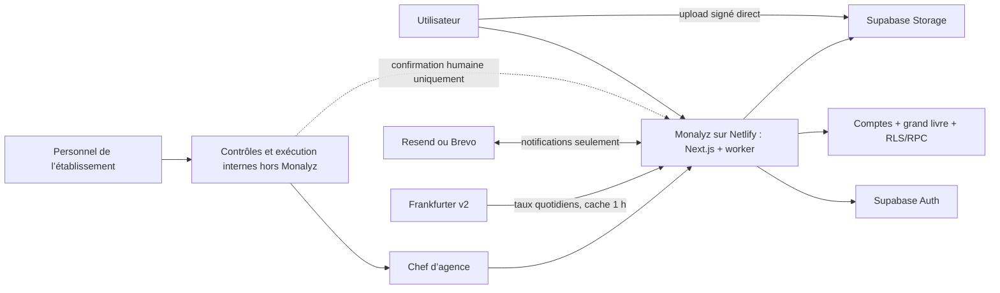
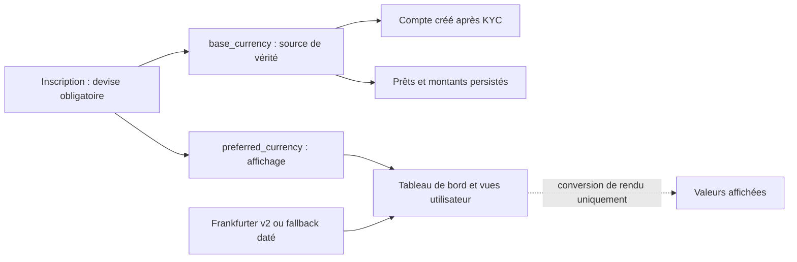
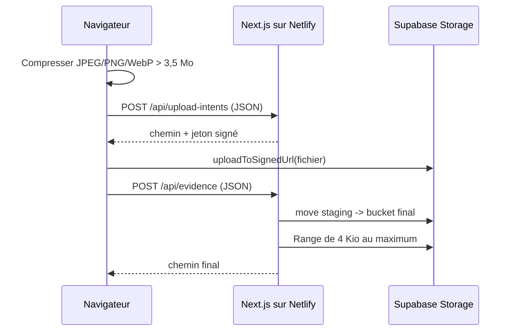
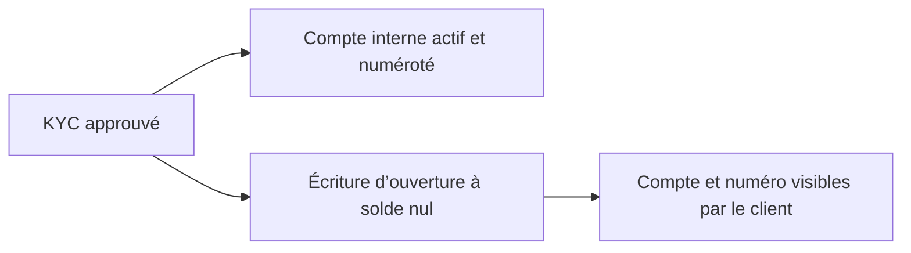

# Architecture

> Monalyz est le registre numérique des comptes, IBAN, soldes, opérations et
> documents officiels déclarés par l’établissement. Il ne se connecte à aucune
> banque et n’exécute aucun mouvement automatiquement.

## Vue d’ensemble

| Zone | Responsabilité |
| --- | --- |
| Netlify | Build Next.js, routes serveur et worker d’e-mails planifié |
| Next.js | UI, sessions SSR, CSP, génération PDF et orchestration de petits JSON |
| Supabase Auth | Identité et session |
| PostgreSQL | Comptes enrichis, grand livre, RLS, machines d’état et audit |
| Storage | Staging et justificatifs privés, PDF officiels privés, assets de marque versionnés |
| Resend ou Brevo | Notifications métier multilingues, sans donnée bancaire |
| Frankfurter v2 | Taux quotidiens indicatifs pour la conversion d’affichage |
| Personnel de l’établissement | Contrôles et exécutions opérationnelles internes, hors Monalyz |
| Chef d’agence | Autorité unique de déclaration, décision et finalisation dans Monalyz |



## Frontières

- `proxy.ts` rafraîchit la session, protège les routes et contrôle le rôle staff.
- `lib/store.tsx` ne modifie pas directement les tables métier : il appelle les RPC.
- les fonctions `SECURITY DEFINER` vérifient `auth.uid()`, les rôles et les états ;
- `/api/upload-intents` émet une capacité d’upload étroite, temporaire et liée
  à l’utilisateur ;
- `/api/evidence` vérifie origine, session, propriété du staging, taille, MIME
  et signature binaire sans télécharger le fichier complet ;
- les routes `/api/official-documents` émettent le PDF après contrôle de rôle,
  puis autorisent son téléchargement par une URL Storage signée après RLS ;
- le navigateur ne reçoit jamais de clé privilégiée ; son écriture Storage
  temporaire utilise uniquement le jeton signé du chemin autorisé ;
- aucune API bancaire, aucun agrégateur de comptes et aucun moteur de paiement
  ne fait partie de l’architecture.
- Frankfurter est une source de taux indicatifs pour le rendu seulement : une
  indisponibilité déclenche un fallback daté, sans modifier le registre.

## Flux des devises

La devise obligatoire choisie lors de l’inscription initialise à la fois
`profiles.base_currency` (immuable pour l’utilisateur) et
`profiles.preferred_currency` (affichage). Le compte créé après approbation KYC
et les demandes de prêt utilisent la devise de référence. Un changement dans
les paramètres ne modifie que la préférence d’affichage ; le store recharge
cette préférence et convertit chaque valeur avant son rendu.



## Téléversements compatibles Netlify

Aucune requête du navigateur vers une route applicative ne transporte un
fichier complet. Le navigateur prépare l’objet, demande un intent en JSON, puis
l’envoie directement dans le bucket privé `upload-staging`. La finalisation
reçoit seulement le bucket, le type logique et le chemin temporaire.



La compression accepte une source raster jusqu’à 25 Mio, conserve le format,
réduit progressivement qualité et dimensions et limite le plus grand côté à
3 200 px. Les PDF et les formats non pris en charge restent byte-identiques.
Après préparation, les preuves sont plafonnées à 10 Mio et les sources de
marque à 5 Mio ; le bucket de staging est lui-même privé et plafonné à 10 Mio.

La publication de marque suit le même staging. Pour générer les dérivés, la
route administrateur relit depuis Storage chaque source privée de 5 Mio au
maximum, côté serveur ; ce flux sortant ne passe pas par le corps de la requête
cliente. Elle vérifie les signatures avant toute génération. En cas d’échec ou
d’abandon, le client et le serveur tentent de supprimer les objets temporaires
sans masquer l’erreur d’origine.

Les policies historiques d’écriture directe dans les buckets finaux sont
supprimées par migration. Un navigateur authentifié ne peut donc pas contourner
le staging, le contrôle de signature et le déplacement privilégié.

## Registre des comptes et des soldes

`financial_positions` est l’agrégat de compte consommé par l’application.
L’approbation KYC crée dans la même transaction une position courante active à
solde nul. La base lui attribue un numéro interne unique de 10 chiffres ; ce
numéro n’est jamais saisi dans le navigateur. L’IBAN, le BIC et l’agence sont
gérés par la banque hors Monalyz et ne sont ni requis ni fabriqués lors de
cette ouverture automatique.

Chaque création ou variation effective du solde ajoute, dans la même
transaction, une ligne à `financial_ledger_entries`. Ce grand livre est
append-only : une erreur est corrigée par une nouvelle écriture motivée via
`branch_manager_adjust_balance`, jamais en réécrivant l’historique. Le solde de
`financial_positions` reste l’agrégat courant ; le grand livre en fournit la
provenance séquencée.



Les comptes de démonstration utilisent un IBAN synthétique valide et
`is_demo = true`. Ils sont clairement marqués dans l’interface et ne peuvent
pas être confondus avec une exécution réelle.

## Suppression des comptes clients pendant les tests réels

La suppression administrateur conserve les comptes du personnel hors périmètre
et traite les comptes clients dans cet ordre : inventaire et suppression
Storage initiale, purge relationnelle, puis suppression immédiate de l’identité
Supabase Auth. L’adresse e-mail est alors libérée et peut être utilisée sans
attendre par un nouveau compte, dont l’UUID est distinct.

Dans le registre clients, un seul clic démarre l’inventaire, valide le défi
idempotent puis enchaîne automatiquement les lots jusqu’à cette suppression
Auth. La cible et son adresse sont relues côté serveur depuis la session
administrateur et Supabase Auth ; le navigateur ne fournit ni adresse de
confirmation ni mot de passe pour cette opération.

Une opération privée attachée uniquement à l’ancien UUID reste ensuite en
attente pendant 2 h 05, durée couvrant les anciennes URL d’upload signées. Le
worker planifié supprime les éventuels objets tardifs de cet ancien préfixe,
vérifie leur absence et finalise l’opération. Les données, l’identité et les
fichiers d’un compte recréé avec le même e-mail ne font pas partie de ce
nettoyage résiduel.

## Résolution de la langue

Le layout racine résout la langue avant le premier rendu afin que toute entrée
directe, publique ou authentifiée, porte immédiatement le bon attribut
`<html lang>`. Les langues prises en charge sont `fr`, `en`, `de` et `es`.

La priorité est stable :

1. `profiles.preferred_language` pour une session authentifiée ;
2. le choix explicite conservé dans les cookies Monalyz ;
3. `Accept-Language` au serveur, puis `navigator.languages` au montage client ;
4. `fr` si aucune préférence compatible n’existe.

Les balises BCP 47 sont normalisées par langue principale : par exemple
`fr-CA` devient `fr` et `es-MX` devient `es`. Le détecteur client ne remplace
jamais une sélection explicite. Un changement manuel synchronise l’interface,
les cookies et, après authentification, le profil Supabase.

## Flux d’un virement

1. L’utilisateur remplit et soumet le formulaire de virement. La base réserve
   le montant sur sa position interne, sans débit définitif.
2. Le chef d’agence valide séparément les quatre contrôles, dans cet ordre :
   double validation interne, escalade hiérarchique, contrôle conformité,
   autorisation finale.
3. Chaque validation est journalisée avec son auteur, sa note et sa date. Le
   dashboard client affiche 25 %, 50 %, 75 % puis 100 %.
4. La quatrième validation clôture atomiquement le virement : la position
   interne est débitée, la réservation est libérée, une écriture de grand livre
   et une notification client sont créées, puis l’e-mail de réussite est mis en
   file d’envoi.

Une annulation ou un rejet libère la réservation ; elle ne crée pas un
« remboursement », puisqu’aucun débit n’a encore eu lieu. Les statuts
`approved_for_external_execution` et `external_execution_recorded` restent
lisibles pour les dossiers historiques.

## Flux d’un prêt

1. L’utilisateur soumet sa demande sans téléverser de justificatif dans le
   formulaire de prêt ; les pièces d’identité et de domicile proviennent du KYC.
2. Le personnel compétent de l’établissement réalise tous les contrôles
   nécessaires dans ses procédures internes, hors de Monalyz.
3. Après ces contrôles, le chef d’agence complète seul les contrôles requis
   dans l’application et valide la demande.
4. Le personnel compétent effectue le décaissement réel en interne, hors de
   Monalyz.
5. Après ce décaissement, le chef d’agence sélectionne dans l’application la
   position courante de l’utilisateur et confirme le décaissement.
6. Monalyz crédite cette position interne du montant du prêt.
7. Le dossier devient final et l’utilisateur reçoit un e-mail de réussite.

La machine d’état nominale est donc :

```text
submitted
  -> approved_for_external_funding
  -> external_settlement_confirmed
```

Les noms `external_*` sont conservés dans le schéma pour compatibilité
historique. Dans le MVP actuel, ils signifient « exécuté hors Monalyz dans les
processus internes de l’établissement », et non « transmis à une API bancaire
externe ». Les anciens états intermédiaires restent acceptés pour les dossiers
déjà existants. Le chef d’agence peut refuser une demande avant sa finalisation.
Monalyz ne gère pas les contrôles bancaires, le contrat, l’échéancier, le
remboursement automatique ou le recouvrement.

## Documents officiels

Le chef d’agence peut émettre un RIB, un relevé de compte, une attestation de
solde, une confirmation de virement ou une décision/confirmation de prêt. La
RPC `branch_manager_issue_official_document` fige un snapshot métier,
sa langue, son numéro et son empreinte. La route serveur rend le PDF, calcule
son SHA-256, le dépose dans le bucket privé `official-documents`, puis le
finalise avec la RPC réservée au `service_role`
`complete_official_document`.

`official_documents` conserve la version, l’émetteur, les empreintes, le
chemin privé et les éventuelles révocations. Une révocation ajoute son acteur
et son motif ; elle ne détruit ni la ligne ni le fichier audité. Les PDF de
démonstration portent un filigrane explicite et `is_demo = true`.

Au téléchargement, Next.js applique la session et la RLS puis répond `307` vers
une URL Storage signée pendant 60 secondes. Le PDF privé ne traverse donc ni la
réponse Next.js ni une fonction Netlify.

Le terme « officiel » signifie ici « émis et traçable par l’établissement ».
Il ne suppose ni certification par un tiers, ni connexion à une banque, ni
exécution automatique.

## E-mails métier

Chaque changement de statut utile crée, dans la même transaction SQL, une
entrée unique dans `transactional_email_outbox`. Après la validation de la
transaction, la fonction Netlify `transactional-email-worker`, planifiée
chaque minute, utilise un client Supabase privilégié pour réclamer jusqu’à cinq
jobs. Elle en traite deux en parallèle, avec un timeout fournisseur de trois
secondes, relit la langue courante puis rend le modèle. Un incident de lecture
ou de fournisseur ne revient jamais sur la décision financière : l’outbox
conserve le message pour une nouvelle tentative.

Netlify active automatiquement cette cadence uniquement sur un deploy publié.
La route authentifiée `/api/transactional-email/dispatch` reste disponible pour
un lot interactif de dix jobs maximum, limité au destinataire sauf pour le chef
d’agence. Aucune route publique n’expose le worker planifié.

Les événements couverts sont la soumission, la validation, le refus, l’échec
et la finalisation d’un virement, ainsi que la soumission, la validation, le
refus, l’échec et le décaissement d’un prêt.

## Défense en profondeur

- CSP à nonce par requête, `frame-ancestors 'none'` et en-têtes anti-sniffing ;
- navigation interne normalisée contre les redirections ouvertes ;
- RLS sur toutes les tables publiques ;
- privilèges directs révoqués au profit de RPC étroites ; la migration de
  production révoque aussi `EXECUTE` par défaut à `anon` et n’accorde à
  `authenticated` que les RPC applicatives explicitement listées ;
- accès propriétaire ou chef d’agence aux comptes, écritures et documents ;
- montants stockés en unités mineures entières.

Voir [le modèle de données](data-model.md) et
[l’ADR-0002](adr/0002-internal-official-banking-register.md).
