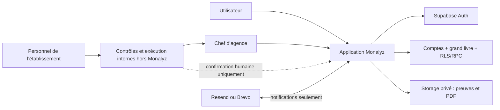
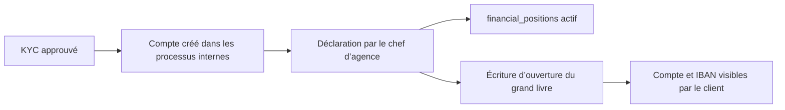

# Architecture

> Monalyz est le registre numérique des comptes, IBAN, soldes, opérations et
> documents officiels déclarés par l’établissement. Il ne se connecte à aucune
> banque et n’exécute aucun mouvement automatiquement.

## Vue d’ensemble

| Zone | Responsabilité |
| --- | --- |
| Next.js | UI, sessions SSR, CSP, génération et téléchargement des PDF |
| Supabase Auth | Identité et session |
| PostgreSQL | Comptes enrichis, grand livre, RLS, machines d’état et audit |
| Storage | Justificatifs privés KYC/prêt et documents officiels PDF |
| Resend ou Brevo | Notifications métier multilingues, sans donnée bancaire |
| Personnel de l’établissement | Contrôles et exécutions opérationnelles internes, hors Monalyz |
| Chef d’agence | Autorité unique de déclaration, décision et finalisation dans Monalyz |



## Frontières

- `proxy.ts` rafraîchit la session, protège les routes et contrôle le rôle staff.
- `lib/store.tsx` ne modifie pas directement les tables métier : il appelle les RPC.
- les fonctions `SECURITY DEFINER` vérifient `auth.uid()`, les rôles et les états ;
- la route `/api/evidence` vérifie origine, session, taille, MIME et signature binaire ;
- les routes `/api/official-documents` émettent et téléchargent les PDF après
  contrôle de session, de rôle et de RLS ;
- le navigateur n’accède jamais à une clé privilégiée ni à un bucket public ;
- aucune API bancaire, aucun agrégateur de comptes et aucun moteur de paiement
  ne fait partie de l’architecture.

## Registre des comptes et des soldes

`financial_positions` est l’agrégat de compte consommé par l’application. Une
position active porte les données déclarées par l’établissement : titulaire,
numéro de compte, IBAN, BIC, établissement, agence, devise, type de compte et
solde. Le chef d’agence déclare le compte avec
`branch_manager_declare_account` après sa création dans les procédures
internes. L’approbation KYC seule ne crée donc aucun compte.

Chaque création ou variation effective du solde ajoute, dans la même
transaction, une ligne à `financial_ledger_entries`. Ce grand livre est
append-only : une erreur est corrigée par une nouvelle écriture motivée via
`branch_manager_adjust_balance`, jamais en réécrivant l’historique. Le solde de
`financial_positions` reste l’agrégat courant ; le grand livre en fournit la
provenance séquencée.



Les comptes de démonstration utilisent un IBAN synthétique valide et
`is_demo = true`. Ils sont clairement marqués dans l’interface et ne peuvent
pas être confondus avec une exécution réelle.

## Résolution de la langue

Le layout racine résout la langue avant le premier rendu afin que toute entrée
directe, publique ou authentifiée, porte immédiatement le bon attribut
`<html lang>`. Les langues prises en charge sont `fr`, `en`, `de` et `es`.

La priorité est stable :

1. `profiles.preferred_language` pour une session authentifiée ;
2. le choix explicite conservé dans les cookies Monalyz ;
3. `Accept-Language` au serveur, puis `navigator.languages` au montage client ;
4. `fr` si aucune préférence compatible n’existe.

Les balises BCP 47 sont normalisées par langue principale : par exemple
`fr-CA` devient `fr` et `es-MX` devient `es`. Le détecteur client ne remplace
jamais une sélection explicite. Un changement manuel synchronise l’interface,
les cookies et, après authentification, le profil Supabase.

## Flux d’un virement

1. L’utilisateur remplit et soumet le formulaire de virement. La base réserve
   le montant sur sa position interne, sans débit définitif.
2. Le personnel compétent de l’établissement réalise tous les contrôles
   nécessaires dans ses processus internes, hors de Monalyz.
3. Après ces contrôles, le chef d’agence complète seul les contrôles requis
   dans l’application et valide la demande.
4. Le dossier devient autorisé pour exécution interne, toujours sans débit.
5. Un opérateur réalise le virement dans les systèmes ou procédures internes
   de l’établissement, hors Monalyz, et remet les éléments de confirmation au
   chef d’agence.
6. Le chef d’agence confirme dans Monalyz que le virement est effectif.
7. La position interne est débitée, le dossier devient final et l’utilisateur
   reçoit un e-mail de réussite.

Une annulation ou un rejet libère la réservation ; elle ne crée pas un
« remboursement », puisqu’aucun débit n’a encore eu lieu.

## Flux d’un prêt

1. L’utilisateur soumet sa demande avec les justificatifs nécessaires.
2. Le personnel compétent de l’établissement réalise tous les contrôles
   nécessaires dans ses procédures internes, hors de Monalyz.
3. Après ces contrôles, le chef d’agence complète seul les contrôles requis
   dans l’application et valide la demande.
4. Le personnel compétent effectue le décaissement réel en interne, hors de
   Monalyz.
5. Après ce décaissement, le chef d’agence sélectionne dans l’application la
   position courante de l’utilisateur et confirme le décaissement.
6. Monalyz crédite cette position interne du montant du prêt.
7. Le dossier devient final et l’utilisateur reçoit un e-mail de réussite.

La machine d’état nominale est donc :

```text
submitted
  -> approved_for_external_funding
  -> external_settlement_confirmed
```

Les noms `external_*` sont conservés dans le schéma pour compatibilité
historique. Dans le MVP actuel, ils signifient « exécuté hors Monalyz dans les
processus internes de l’établissement », et non « transmis à une API bancaire
externe ». Les anciens états intermédiaires restent acceptés pour les dossiers
déjà existants. Le chef d’agence peut refuser une demande avant sa finalisation.
Monalyz ne gère pas les contrôles bancaires, le contrat, l’échéancier, le
remboursement automatique ou le recouvrement.

## Documents officiels

Le chef d’agence peut émettre un RIB, un relevé de compte, une attestation de
solde, une confirmation de virement ou une décision/confirmation de prêt. La
RPC `branch_manager_issue_official_document` fige un snapshot métier,
sa langue, son numéro et son empreinte. La route serveur rend le PDF, calcule
son SHA-256, le dépose dans le bucket privé `official-documents`, puis le
finalise avec la RPC réservée au `service_role`
`complete_official_document`.

`official_documents` conserve la version, l’émetteur, les empreintes, le
chemin privé et les éventuelles révocations. Une révocation ajoute son acteur
et son motif ; elle ne détruit ni la ligne ni le fichier audité. Les PDF de
démonstration portent un filigrane explicite et `is_demo = true`.

Le terme « officiel » signifie ici « émis et traçable par l’établissement ».
Il ne suppose ni certification par un tiers, ni connexion à une banque, ni
exécution automatique.

## E-mails métier

Chaque changement de statut utile crée, dans la même transaction SQL, une
entrée unique dans `transactional_email_outbox`. Après la validation de la
transaction, la route serveur utilise un client Supabase privilégié pour
réclamer un lot d’e-mails. Elle relit la langue courante du destinataire juste
avant chaque appel Resend ou Brevo, puis rend le modèle dans cette langue. Un
incident de lecture ou de fournisseur ne revient jamais sur la décision
financière : l’outbox conserve le message pour une nouvelle tentative.

Les événements couverts sont la soumission, la validation, le refus, l’échec
et la finalisation d’un virement, ainsi que la soumission, la validation, le
refus, l’échec et le décaissement d’un prêt.

## Défense en profondeur

- CSP à nonce par requête, `frame-ancestors 'none'` et en-têtes anti-sniffing ;
- navigation interne normalisée contre les redirections ouvertes ;
- RLS sur toutes les tables publiques ;
- privilèges directs révoqués au profit de RPC étroites ;
- accès propriétaire ou chef d’agence aux comptes, écritures et documents ;
- montants stockés en unités mineures entières.

Voir [le modèle de données](data-model.md) et
[l’ADR-0002](adr/0002-internal-official-banking-register.md).
