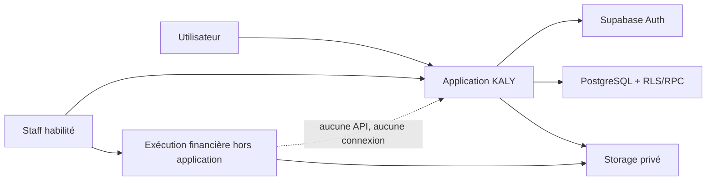

# Architecture

> KALY sépare strictement instruction applicative, exécution financière externe et confirmation interne.

## Vue d’ensemble

| Zone | Responsabilité |
| --- | --- |
| Next.js | UI, sessions SSR, CSP et route de justificatifs |
| Supabase Auth | Identité et session |
| PostgreSQL | RLS, machines d’état, réservations et audit |
| Storage | Preuves privées KYC, prêt et exécution externe |
| Système externe | Mouvement financier réel, hors KALY |

## Frontières

- `proxy.ts` rafraîchit la session, protège les routes et contrôle le rôle staff.
- `lib/store.tsx` ne modifie pas directement les tables métier : il appelle les RPC.
- les fonctions `SECURITY DEFINER` vérifient `auth.uid()`, les rôles et les états ;
- la route `/api/evidence` vérifie origine, session, taille, MIME et signature binaire ;
- le navigateur ne reçoit que des URL signées de courte durée pour les preuves.

## Flux d’un transfert

1. L’utilisateur crée une intention ; la base réserve un montant interne.
2. Deux membres distincts complètent les contrôles requis.
3. Le dossier devient autorisé pour exécution externe, sans débit.
4. Un opérateur réalise l’opération hors KALY et dépose référence et preuve.
5. Un second membre confirme le règlement.
6. La position interne est ajustée et l’événement devient final.

Une annulation ou un rejet libère la réservation ; elle ne crée pas un
« remboursement », puisqu’aucun débit n’a encore eu lieu.

## Défense en profondeur

- CSP à nonce par requête, `frame-ancestors 'none'` et en-têtes anti-sniffing ;
- navigation interne normalisée contre les redirections ouvertes ;
- RLS sur toutes les tables publiques ;
- privilèges directs révoqués au profit de RPC étroites ;
- identifiants financiers masqués dans les projections UI ;
- montants stockés en unités mineures entières.

Voir [le modèle de données](data-model.md) et [l’ADR fondatrice](adr/0001-external-financial-execution.md).
