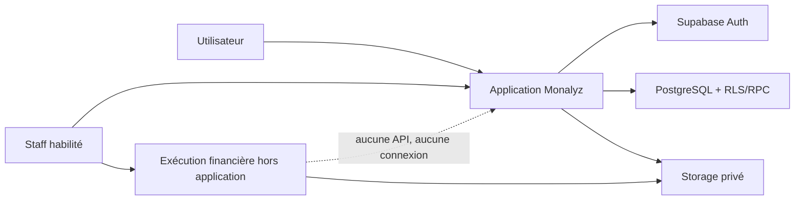

# Architecture

> Monalyz sépare strictement instruction applicative, exécution financière externe et confirmation interne.

## Vue d’ensemble

| Zone | Responsabilité |
| --- | --- |
| Next.js | UI, sessions SSR, CSP et route de justificatifs |
| Supabase Auth | Identité et session |
| PostgreSQL | RLS, machines d’état, réservations et audit |
| Storage | Preuves privées KYC, prêt et exécution externe |
| Système externe | Mouvement financier réel, hors Monalyz |



## Frontières

- `proxy.ts` rafraîchit la session, protège les routes et contrôle le rôle staff.
- `lib/store.tsx` ne modifie pas directement les tables métier : il appelle les RPC.
- les fonctions `SECURITY DEFINER` vérifient `auth.uid()`, les rôles et les états ;
- la route `/api/evidence` vérifie origine, session, taille, MIME et signature binaire ;
- le navigateur ne reçoit que des URL signées de courte durée pour les preuves.

## Flux d’un transfert

1. L’utilisateur crée une intention ; la base réserve un montant interne.
2. Deux membres distincts complètent les contrôles requis.
3. Le dossier devient autorisé pour exécution externe, sans débit.
4. Un opérateur réalise l’opération hors Monalyz et dépose référence et preuve.
5. Un second membre confirme le règlement.
6. La position interne est ajustée et l’événement devient final.

Une annulation ou un rejet libère la réservation ; elle ne crée pas un
« remboursement », puisqu’aucun débit n’a encore eu lieu.

## Flux d’un prêt

La demande de prêt orchestre une étude et la preuve d’un versement externe.
Elle ne constitue ni une offre de crédit, ni un contrat, ni une promesse de
financement.

1. L’utilisateur réalise une simulation indicative et transmet sa demande avec
   au moins un justificatif privé.
2. La RPC `submit_loan_application` enregistre le montant, la durée, le taux et
   la mensualité indicatifs avec une clé d’idempotence.
3. La base crée les contrôles de double revue, d’escalade, de conformité et
   d’autorisation finale.
4. Les quatre contrôles doivent être terminés par au moins deux membres du
   personnel distincts.
5. Le dossier devient `approved_for_external_funding` ; cette autorisation
   interne ne déclenche aucun versement.
6. La contractualisation et le mouvement financier sont réalisés hors de
   Monalyz.
7. Un opérateur enregistre dans Monalyz la référence, la date et la preuve du
   versement externe ; le dossier passe à `external_funding_recorded`.
8. Un superviseur ou administrateur différent de l’opérateur rapproche la
   preuve et confirme le règlement ; le dossier devient
   `external_settlement_confirmed`.

La machine d’état nominale est donc :

```text
submitted
  -> under_review
  -> approved_for_external_funding
  -> external_funding_recorded
  -> external_settlement_confirmed
```

Les sorties alternatives sont `rejected`, `cancelled` et `external_failed`.
Elles sont terminales. Aucun état du prêt ne crédite une position financière
Monalyz et l’application ne gère actuellement ni échéancier contractuel, ni
remboursement automatique, ni recouvrement.

## Défense en profondeur

- CSP à nonce par requête, `frame-ancestors 'none'` et en-têtes anti-sniffing ;
- navigation interne normalisée contre les redirections ouvertes ;
- RLS sur toutes les tables publiques ;
- privilèges directs révoqués au profit de RPC étroites ;
- identifiants financiers masqués dans les projections UI ;
- montants stockés en unités mineures entières.

Voir [le modèle de données](data-model.md) et [l’ADR fondatrice](adr/0001-external-financial-execution.md).
