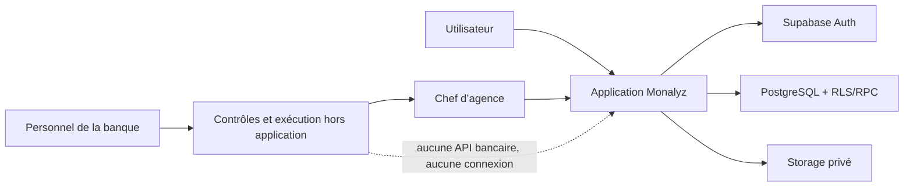

# Architecture

> Monalyz enregistre les demandes et les décisions du chef d’agence. Les
> contrôles bancaires et les mouvements financiers réels restent hors de
> l’application.

## Vue d’ensemble

| Zone | Responsabilité |
| --- | --- |
| Next.js | UI, sessions SSR, CSP et route de justificatifs |
| Supabase Auth | Identité et session |
| PostgreSQL | RLS, machines d’état, réservations et audit |
| Storage | Justificatifs privés KYC et prêt |
| Resend ou Brevo | Notifications métier multilingues, sans donnée bancaire |
| Banque | Contrôles internes et mouvements financiers, hors Monalyz |



## Frontières

- `proxy.ts` rafraîchit la session, protège les routes et contrôle le rôle staff.
- `lib/store.tsx` ne modifie pas directement les tables métier : il appelle les RPC.
- les fonctions `SECURITY DEFINER` vérifient `auth.uid()`, les rôles et les états ;
- la route `/api/evidence` vérifie origine, session, taille, MIME et signature binaire ;
- le navigateur ne reçoit que des URL signées de courte durée pour les preuves.

## Résolution de la langue

Le layout racine résout la langue avant le premier rendu afin que toute entrée
directe, publique ou authentifiée, porte immédiatement le bon attribut
`<html lang>`. Les langues prises en charge sont `fr`, `en`, `de` et `es`.

La priorité est stable :

1. `profiles.preferred_language` pour une session authentifiée ;
2. le choix explicite conservé dans les cookies Monalyz ;
3. `Accept-Language` au serveur, puis `navigator.languages` au montage client ;
4. `fr` si aucune préférence compatible n’existe.

Les balises BCP 47 sont normalisées par langue principale : par exemple
`fr-CA` devient `fr` et `es-MX` devient `es`. Le détecteur client ne remplace
jamais une sélection explicite. Un changement manuel synchronise l’interface,
les cookies et, après authentification, le profil Supabase.

## Flux d’un virement

1. L’utilisateur remplit et soumet le formulaire de virement. La base réserve
   le montant sur sa position interne, sans débit définitif.
2. Le personnel compétent de la banque réalise tous les contrôles nécessaires
   hors de Monalyz.
3. Après ces contrôles, le chef d’agence complète seul les contrôles requis
   dans l’application et valide la demande.
4. Le dossier devient autorisé pour exécution externe, toujours sans débit.
5. Un opérateur réalise le virement hors Monalyz et remet les preuves au chef
   d’agence hors de l’application.
6. Le chef d’agence confirme dans Monalyz que le virement est effectif.
7. La position interne est débitée, le dossier devient final et l’utilisateur
   reçoit un e-mail de réussite.

Une annulation ou un rejet libère la réservation ; elle ne crée pas un
« remboursement », puisqu’aucun débit n’a encore eu lieu.

## Flux d’un prêt

1. L’utilisateur soumet sa demande avec les justificatifs nécessaires.
2. Le personnel compétent de la banque réalise tous les contrôles nécessaires
   hors de Monalyz.
3. Après ces contrôles, le chef d’agence complète seul les contrôles requis
   dans l’application et valide la demande.
4. Le personnel compétent effectue le décaissement réel en interne, hors de
   Monalyz.
5. Après ce décaissement, le chef d’agence sélectionne dans l’application la
   position courante de l’utilisateur et confirme le décaissement.
6. Monalyz crédite cette position interne du montant du prêt.
7. Le dossier devient final et l’utilisateur reçoit un e-mail de réussite.

La machine d’état nominale est donc :

```text
submitted
  -> approved_for_external_funding
  -> external_settlement_confirmed
```

Les anciens états intermédiaires restent acceptés pour les dossiers déjà
existants. Le chef d’agence peut refuser une demande avant sa finalisation.
Monalyz ne gère pas les contrôles bancaires, le contrat, l’échéancier, le
remboursement automatique ou le recouvrement.

## E-mails métier

Chaque changement de statut utile crée, dans la même transaction SQL, une
entrée unique dans `transactional_email_outbox`. Après la validation de la
transaction, la route serveur utilise un client Supabase privilégié pour
réclamer un lot d’e-mails. Elle relit la langue courante du destinataire juste
avant chaque appel Resend ou Brevo, puis rend le modèle dans cette langue. Un
incident de lecture ou de fournisseur ne revient jamais sur la décision
financière : l’outbox conserve le message pour une nouvelle tentative.

Les événements couverts sont la soumission, la validation, le refus, l’échec
et la finalisation d’un virement, ainsi que la soumission, la validation, le
refus, l’échec et le décaissement d’un prêt.

## Défense en profondeur

- CSP à nonce par requête, `frame-ancestors 'none'` et en-têtes anti-sniffing ;
- navigation interne normalisée contre les redirections ouvertes ;
- RLS sur toutes les tables publiques ;
- privilèges directs révoqués au profit de RPC étroites ;
- identifiants financiers masqués dans les projections UI ;
- montants stockés en unités mineures entières.

Voir [le modèle de données](data-model.md) et [l’ADR fondatrice](adr/0001-external-financial-execution.md).
